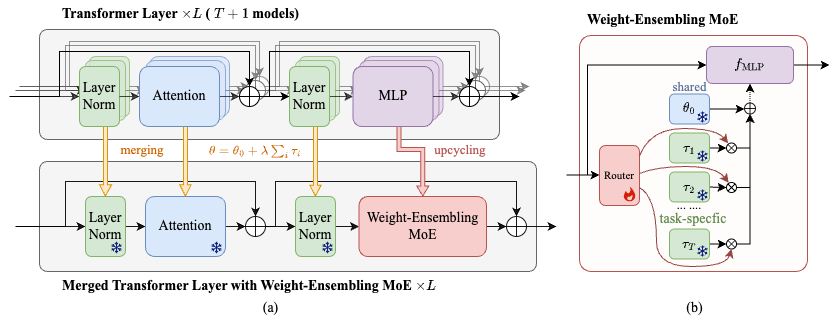

I reimplemented this using the CLIP models from HuggingFace at https://github.com/tanganke/fusion_bench

# Merging Multi-Task Models via Weight-Emsembling Mixture of Experts

## Experimental Results

The results of the experiments in the paper are placed at [results](./results/README.md).

## Acknowledgements

Some of the code in this repository is based on the following repositories:

- https://github.com/EnnengYang/AdaMerging
- https://github.com/mlfoundations/task_vectors
- https://github.com/prateeky2806/ties-merging
