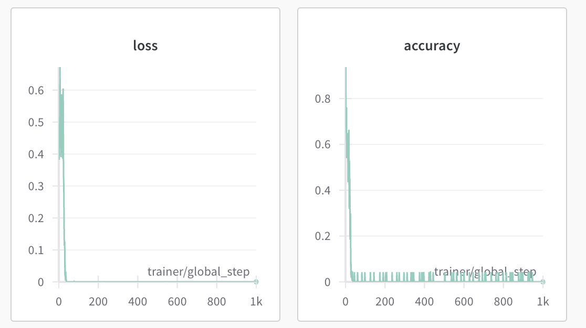
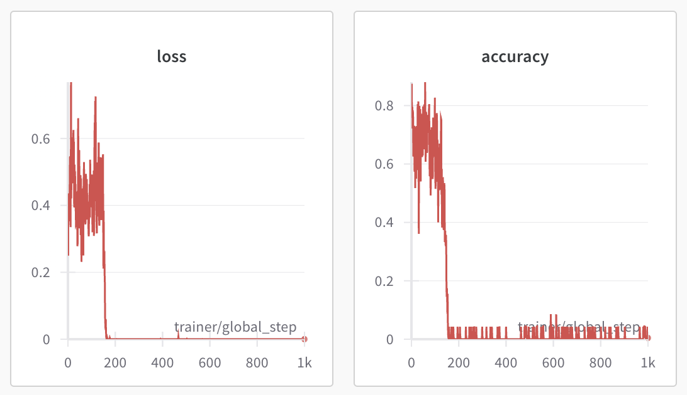
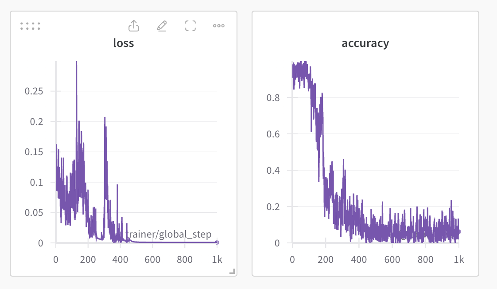
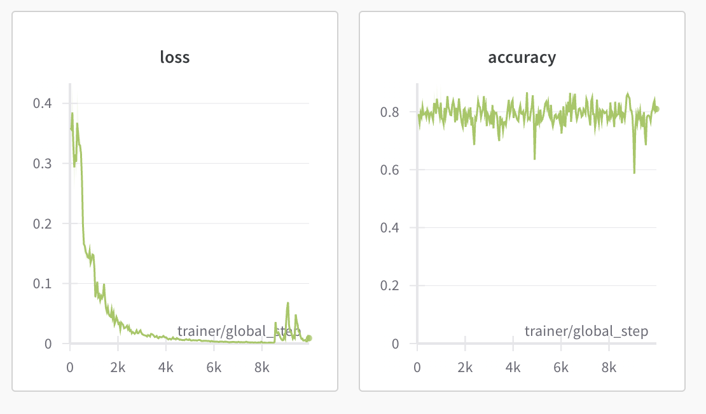
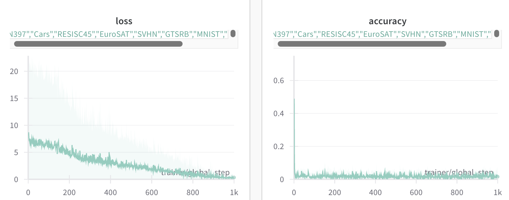
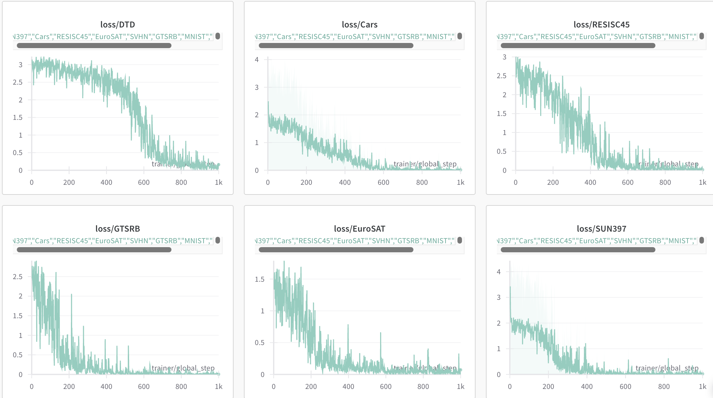
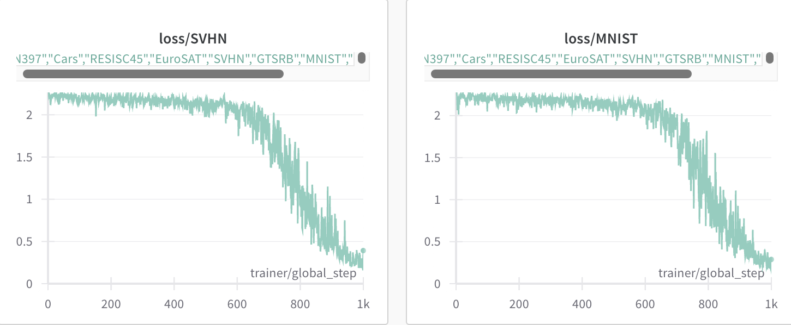
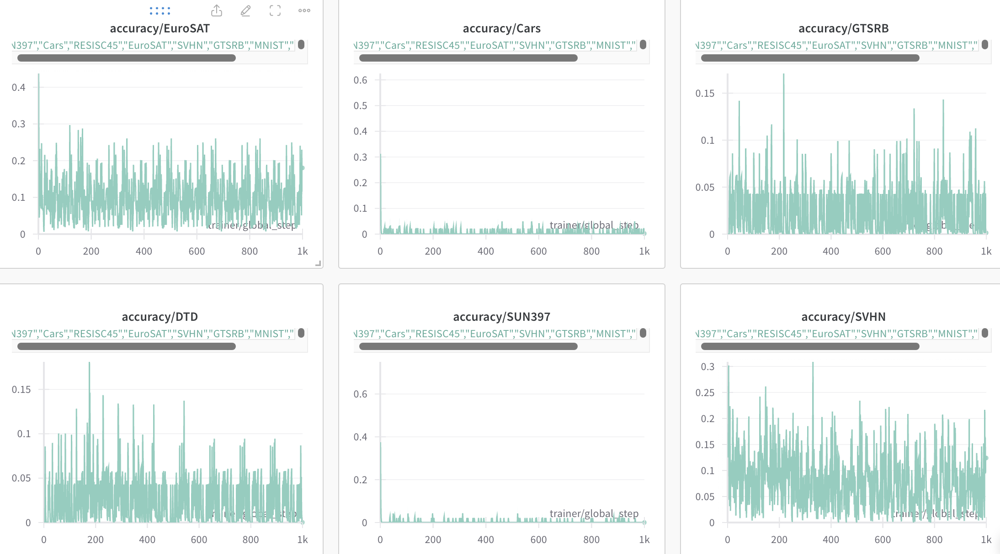
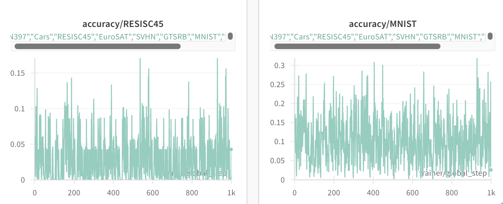

# More details about Test-Time Adaptation (TTA)

Here we are going to show some results about fine-tuning a single model via test-time adaptation training (entropy minimization).
We find it is unstable to full fine-tune a model via test-time adaptation training.

## Single-Task Experiments

In this section, we are going to show some results about single-task models (task-specific CLIP-ViT-B/32 models) TTA on the test dataset.

1. task=Cars, learning rate = 1e-5
  
2. task=Cars, learning rate = 5e-6
  
3. tsak=SVHN, learning rate = 5e-6
  
4. task=Cars, learning rate = 1e-6
  

## Multi-Task Experiments

Here we first obtain a merged model using weight averaging, then full fine-tuning its parameters via test-time adaptation training:

1. overall loss and accuracy:
  
2. entropy loss on each task
  
  
3. accuracy on each task
  
  
